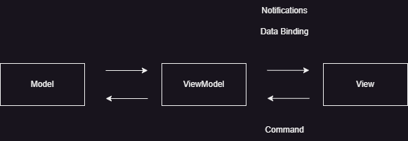

# .NET MAUI学習

## .NET MAUIの仕組み

- 「.NET Multi-Platform App UI」の名前の通り、スマホに限らず、WindowsやMacのデスクトップ環境向けアプリケーションを開発できる。

### マルチプラットフォーム

- Xamarin.Formsの後継となるマルチプラットフォーム開発のためのフレームワーク。
(※Xamarin = ザマリンと読む)

- Xamarin.Formsのさらに前に、Xamarin.iOSとXamarin.AndroidというiOS(iPhoneやiPad)とAndroid向けの開発環境がありましたが、これらを別々の開発環境ではなく、1つの開発環境としたものがXamarin.Formsでした。

- 現在、以下の4つの動作環境が提供されています
  - iOS(iPhone,iPad)
  - Android
  - Windows(UWPアプリケーション)
  - macOS(Mac Catalyst)

### 共通のユーザーインターフェース

- 「XAML」が使われている。XAML形式はXML記述の拡張版で、コンポーネントやデータバインディングの機能が追加されている。

- いったん、XAML形式でUIコントロール(コンポーネント)を解釈したのちに、それぞれのプラットフォームに対して標準コントロールでマッピングします。ボタンやラベルなどの表示は、AndroidやiOS、Windowsでそれぞれ特有のコントロールがあります。それらの似た部分を共通にたように変換するのが、.NET MAUIのレンダリングの役目です。

### .NET MAUIの開発環境

1. Visual Studio 2022の準備
    - 1. Viual Studioのインストール
    - 1. インストールの選択
        - 「.NETマルチプラットフォームアプリのUI開発」(AndroidやiPhoneなどのみの場合はこれだけで良い)
        - 「ASP.NETとWeb開発」
        - 「.NETデスクトップ開発」
1. 新しいプロジェクトの作成
1. ターゲットフレームワークを選択
    - 2022年12月では、ターゲットフレームワークで [.NET 6.0] と [.NET 7.0]のどちらかが選べます。

## 最初の.NET MAUIアプリケーション

- AppShell.xaml: プラットフォーム共通のシェル用のユーザーインターフェース
- MainPage.xaml: プラットフォーム共通のユーザーインターフェース
- Platforms/Android: Androidアプリを作成するための環境依存ファイル
- Platforms/iOS: iPhoneやiPadなどのiOS対応のアプリを作成するための環境依存ファイル
- Platforms/MacCatalyst: macOS対応のアプリを作成するための環境依存ファイル
- Platforms/Windows: Windowsで動作するUWPアプリを作成するための環境依存ファイル

## 画面の部品

### XAMLとは

- 「Extensible Application Markup Language」の略でXMLと同じくマークアップを使ったプログラム言語。クラスマッピングやデータバインドなどの機能を拡張子てC#などのオブジェクトとリンクしやすい
- [ドメイン固有言語の概要](https://learn.microsoft.com/ja-jp/visualstudio/modeling/getting-started-with-domain-specific-languages?view=vs-2022)
- x:Name で実オブジェクトにマッピングする
- x:Class で実クラスにマッピングする
- tagName.propName のように、ドットでつながった名前が特別扱い
- attrName="{Binding xxx}"のような、属性値に{...}を指定した時特別扱い

### デバッグ

- ブレークポイントを置くとアプリが一時停止します。モバイルアプリの場合ブレークポイントで長く止めすぎるとOS側でアプリが無応答(フリーズ)になったと判断してアプリを落してしまうので注意

- 変数や動作の確認の場合、Debugクラスを使ってVisual Studioの出力ウィンドウに対してデバッグしたほうが便利です。

``` C#
System.Diagnostics.Debug.WriteLine("デバッグメッセージ");
```

### ラベル

- 文字列を表示するためのコントロールです。

構文1

``` xaml
<Label Text="表示したい文字列" />

<Label>表示したい文字列</Label>
```

構文2(名前を付けて参照する - オブジェクトとして扱い操作したい時)
``` xaml
<Label x:Name="message" />

```

``` C#
this.message.Text = "表示したい文字列";
```

### ボタン

- ユーザーがタップして何かを実行させるためのコントロールです。

構文1

``` xaml
<Button
  Text="ボタンのテキスト"
  Clicked="イベント名"
/>
```

構文2

``` xaml
<Button
  Clicked="イベント名">
  <Button.Text>
    ボタンに表示する文字列
  </Button.Text>
</Button
```

- ボタンの設定

``` xaml
<Button
  Text="Click me"
  Clicked="Button_Clicked" />
```

``` C#
private void Button_Clicked(object sender, EventArgs e)
{
    // イベントの記述
}
```

### 入力テキスト

``` xaml
<Entry
  x:Name="オブジェクト名"
  Placeholder="プレースホルダ"
/>
```

### アニメーション

- 各UIコントロールには、簡単なアニメーション機能が追加されている
- このメソッド群は非同期で実行される。そのため、操作を同期的に行いたい場合は「async/await」構文を使う。

``` xaml
<対象のコントロール
  x:Name="対象のオブジェクト名"
  />
```

``` 回転
オブジェクト名.RotateTo(角度, 時間);
```

### 画像

- 画像ファイルは、ソリューションエクスプローラーの「/Resources/Images」フォルダの中に配置します。
- ビルドアクションは「MauiImage」であり、.NET MAUIアプリケーションのリソースとして取り込まれます。
- HeightRequest・WidthRequest属性を付与すると画像が伸縮されます。この時アスペクト比を保ったままにするか(AspectFit)、指定サイズに合うように伸長するか(Fill)などの指定が可能です。

``` xaml
<Image Source="画像ファイル名" />
```

### ブラシ

- 塗りつぶしを行うことができる
- ブラシの種類には「SolidColorBrush(単一色塗りつぶし)」、「LinearGradientBrush(線形グラデーションで塗りつぶし)」、「RadialGradientBrush(放射線状のグラデーション)」がある。

ブラシの構文1
``` xaml
<対象のコントロール
  Background="色の名前"
/>
```

ブラシの構文2
``` xaml
<対象のコントロール
  Background="16進数表記" />
```

ブラシの構文3
``` xaml
<Label>
  <Label.Background>
   <SolidColorBrush Color="Red" />
  </Label.Background>
</Label>
```

背景色の設定
``` xaml
オブジェクト名.Background = new SolidColorBrush(Colors.Blue);
```

### スタックレイアウト

- 垂直方向に並べる(VerticalStackLayout)と、水平方向に並べる(HorizontalStackLayout)がある
- 本格的なアプリであっても、VerticalStackLayoutとHorizontalStackLayoutを組み合わせて画面を構成することができます。ただし、各UIコントロールの横幅を統一したり、ナビゲーション用のボタンをきれいに並べたりしたいときは、グリッドレイアウトなどを使う方が整えられた画面になります。

``` xaml
<VerticalStackLeyout 
  VerticalOptions="並べ方"
/>
```

``` xaml
<HorizontalStackLayout 
  HorizontalOptions="並べ方"
/>
```

### グリッドレイアウト

- グリッド(格子状)にコントロールを並べる方法です。
- 一時期、Webサイトのデザインに12分割のグリッドシステムが使われ、縦方向の配置を揃えることによって画面を素早くかつ綺麗に整えられる手法が流行りましたが、これはWebサイト意外にも有効です。

グリッドレイアウトの構文
``` xaml
<Grid>
  <Grid.RowDefinitions>
    <RowDefinition Height="高さ" />
  </Grid.RowDefinitions>
  <Grid.ColumnDefinitions>
    <ColumnDefinition Width="横幅" />
  </Grid.ColumnDefinitions>
</Grid>
```
- 行の数は、Grid.RowDefinitionsで設定、それぞれの行の高さをRowDefinitionのHeight属性で指定。
- Height属性で指定できる値「auto」とすると、コントロールに必要な高さを自動的に計算してくれる
- 列の数はGrid.ColumnDefinitionsで設定し、それぞれの幅はColumnDefinitionのWidth属性で指定。

### Flexレイアウト

- エリアごとにコントロールを配置する独立型のレイアウト。(CSSのflexboxのイメージ)

構文
``` xaml
<FlexLayout Direction="配置方向">
</FlexLayout>
```

### ナビゲーション

- 全画面が切り替わるナビゲーション方式。NavigationPageクラスを使うことで、Androidの戻るボタンなどで、画面の遷移ができるようになる。

#### ナビゲーションの準備

- ナビゲーション機能を有効にするにはApp.xaml.csを修正します。

App.xaml.cs
``` cs
public partial class App : Application
{
  public App()
  {
    InitializeComponent();
    MainPage = new NavigationPage(new MainPage());
  }
}
```

MainPageプロパティに、NavigationPageクラスのインスタンスを設定しておく。
新しいページに遷移する時は、PushAsyncメソッドを使います。

新しいページに移動する時
``` cs
private async void OnNextClicked(object sender, EventArgs e)
{
  await Navigation.PushAsync(new NextPage());
}
```

前のページに戻る時
``` cs
private async void OnBackClick(object sender, EventArgs e)
{
  await Navigation.PopAsync();
}
```

#### ナビゲーションの種類

|メソッド名|説明|
|---|---|
|PushAsync|次のページに遷移する|
|PushModalAsync|次のページにモーダルで遷移する|
|PopAsync|前のページに遷移する|
|PopModalAsync|前のページにモーダルで遷移する|
|PopToRootAsync|ルートのページに戻る|
|RemovePage|指定ページをヒストリーから削除する|

#### ポップアップ

構文

``` xaml
await DisplayAlert("タイトル", "表示メッセージ", "ボタンの種類");
```

構文2
``` xaml
bool result = await DisplayAlert("タイトル", "表示メッセージ", "YESの表示", "NOの表示");
```

構文3
```xaml
string result  await DisplayPromptAsync("タイトル", "表示メッセージ");
```

### グラフィック表示

#### GraphicsViewコントロール

- 固定の画像であればImageコントロールで良いが、細かいグラフの更新や図形の更新などはグラフィック表示を扱うことになる

- ページ内の固定リソースとして「GraphicsDrawable」を定義。例は「drawable」という名称で参照できるように設定している
※(xmlns:local="clr-namespace:～でContentPageタグにも設定が必要)

``` xaml
<ContentPage.Resources>
  <local:GraphicsDrawable x:Key="drawable" />
</ContentPage.Resources>

<GraphicsView
  Drawable="{StaticResource drawable}"
  HeightRequest="200"
  WidthRequrest="200"
/>
```

Drawメソッド
``` cs
public class GraphicsDrawable : IDrawable
{
  public void Draw(ICanvas canvas, RectF dirtyReact)
  {
  }
}
```

#### テーマ

- テーマ設定は「Application.Current.UserAppTheme」で行う

``` cs
Application.Current.UserAppTheme = AppTheme.Light;
```

### リスト表示

- 一覧表示をするためのコントロールとしてはListView、CollectionViewがある。
- ListView：項目を1行で表示する
- CollectionView：テキストや画像をGridを使って外観をレイアウトしていく


#### ListView

構文
```xaml
<ListView>
  <ListView.ItemTemplate>
    <DataTemplate>
     表示するコントロール
    </DataTemplate>
  </ListView.Itemtemplate>
</ListView>
```

#### CollectionView

- 基本的にはListViewを同じ書き方
- 選択モードには単数(Single)と複数(Multiple)がある

構文
``` xaml
<CollectionView>
  <CollectionView.ItemTemplate>
    <DataTemplate>
      表示するコントロール
    </DataTemplate>
  </CollectionView.Itemtemplate>
</CollectionView>
```

### ピッカー

- htmlのselectタグのようなコントロール

構文
``` xaml
<Picker
  x:Name="オブジェクト名"
  SelectedIndexChanged="イベントメソッド名"
/>
```

### スイッチ

- ON/OFFを切り替えるような物理的なスイッチ

構文
``` xaml
<Switch
  x:Name="オブジェクト名"
  Toggled="イベントメソッド名"
/>
```

### 日付選択

構文
``` xaml
<DatePicker
  x:Name="オブジェクト名"
  DateSelected="イベント名"
/>
```

## データバインド

### MVVMパターンとは

- アプリケーションをView(ビュー)、Model(モデル)、ViewModel(ビューモデル)の3つの層に分割するデザインパターン

#### MVVMパターンの実装

- View
  - XAML形式などで作成したユーザーインターフェース部分を示す

- Model
  - データを保持するクラス。単純なプロパティ呑みを保持する「値クラス」やEntityFrameworkを利用したデータクラスを対象にすることも

- ViewModel
  - ユーザーインターフェースのViewと、データを保持するModelのつなぎ部分。
  - INotifyPropertyChangedインターフェースを継承して、プロパティのイベントをViewに通知します。通知先のUIコントロールのプロパティにはあらかじめ「Binding」をしておきます。
  
  - INotifyPropertyChangedインターフェースの定番実装方法
    - ViewModelからViewにプロパティの値が変更したことを知らせるために、PropertyChangedEventHandler型でイベントを作成します。通常は「PropertyChanged」と命名。
    - ViewModel側でプロパティの内容を変更した時にViewに通知します。OnPropertyChangedメソッドを作成して、プロパティのsetメソッドを使います。
    - ViewからのイベントはICommandインターフェースを継承したCommandオブジェクトを作成します。
    - XAML形式のViewには、ViewModelと結びつけるための属性にバインド(Binding)を設定します。
    - バインディング可能なプロパティは、DependencyPropertyオブジェクトが設定されている。

#### ライブラリの使用

- ViewModelクラスを作成するときのパターンは決まっているため、手はを省くためライブラリの使用を検討する。

- 「Prism.Core」、「ReactiveProperty」

#### リストのバインディング

- ItemSourceプロパティに設定する全体リストは、List<T>コレクションや、ObservableCollection<T>コレクションを使います。

CollectionViewコントロールへのバインド
``` xaml
<CollectionView
  ItemsSource="{Binding <全体リスト>}"
  SelectedItem="{Binding <選択プロパティ>}"
  ... >
  <CollectionView.ItemTemplate>
    <DataTemplate>
      ...
    </DataTemplate>
  </CollectionView.ItemTemplate>
</CollectionView>
```

```C#
public class ViewModel : BindableBase
{
  public コレクション型 <全体リスト> { get; set; }
  private 型 <選択フィールド> = null;
  public 型 <選択プロパティ>
  {
    get => 選択項目フィールド
    set => SetProperty(ref 選択フィールド, value, nameof(選択項目プロパティ));
  }
}
```

## コードでのみ記述

- 現在では Xamarin.Formsでのアプリケーションは、XAML形式が主流ですが、最初の頃にはコードを使ってのサンプルが多くありました。
- コードを使う時の利点は、部品が似たような画面を作る場合にコードで自動生成できることです。
 
``` C#
private void CodeOnlyPage_Loaded(object sender, EventArgs e)
{
	Button backButton = new Button()
	{
		Text = "戻る",
	};
	backButton.Clicked += async (_, _) =>
	{
		await Navigation.PopAsync();
	};

	this.Content = new ScrollView
	{
		Content = new VerticalStackLayout
		{
			Spacing = 25,
			Padding = new Thickness(30, 0),
			VerticalOptions = LayoutOptions.Center,
			Children =
			{
				new Label
				{
					FontSize = 32.0,
					HorizontalOptions = LayoutOptions.Center,
					Text = "Hello, Code Only World",
				},
				new Label
				{
					FontSize = 18,
					HorizontalOptions = LayoutOptions.Center,
					Text = "ようこそ、.NET MAUIの世界へ"
				},
				new Label { FontSize = 24, Text = "坊ちゃん" },
				new Label { FontSize = 18, Text = "夏目漱石" },
				backButton
			}
		}
	};
}
```


### 参考サイトなど

- [MAUIの基本的なはまりどころメモ](https://tech.tinybetter.com/Article/b8d8e45e-5cf8-81c7-fa5a-39fea40a01bf/View)
